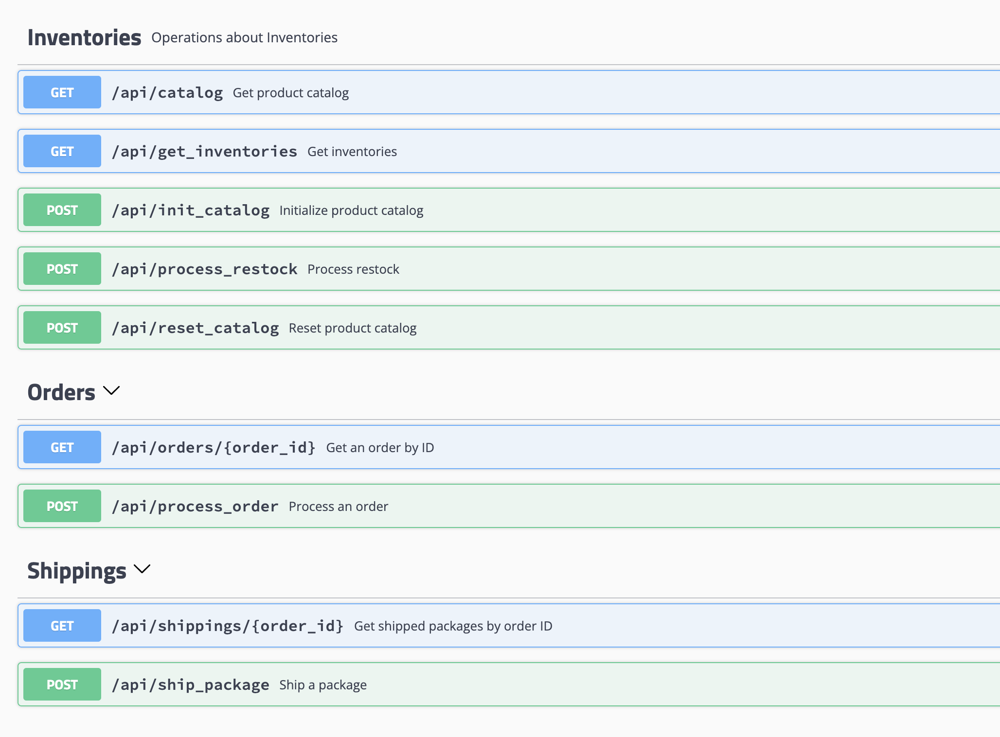

# ZeroX Fullstack Challenge

Welcome to the ZeroX Fullstack Challenge repository! This project showcases a comprehensive solution to various challenges faced by ZeroX, a leading supplier of blasting materials in Wakanda. The repository consists of five tasks, each addressing a specific aspect of ZeroX's operations and technical requirements.


### Inventory API (Elixir Phoenix, GenServers)
A backend system built with Elixir and the Phoenix framework for efficient inventory management and order processing. The system utilizes GenServers to handle concurrent requests and maintain a consistent state.

#### Key Features

- `init_catalog`: Initializes the product catalog before any other operations. Ensures the existence of a valid catalog for subsequent actions.
- `process_restock`: Handles the addition of new inventory to the system after catalog initialization. Updates the inventory levels based on the received restock information.
- `process_order`: Processes incoming orders based on the current inventory levels. Intelligently manages order fulfillment, considering factors such as product availability and maximum shipment size.
- `ship_package`: Coordinates the shipping of packages for fulfilled orders. Generates the necessary shipment details and invokes the appropriate shipping provider APIs

#### Improvements features

- `reset_catalog`: This service is expected to be called at the end of the life cycle, to initialize a new catalog.
- `catalog`: This endpoint is to fetch the existing catalog.
- `get_inventories`: This endpoint fetches the existing inventories to give update about the stock.
- `orders/order_id`: This endpoint fetches the order by order_id
- `shippings/order_id`: This endpoint fetches the shipped package by order_id, it allows to easily truck the shipped packages.

#### General overview of the implemented services and endpoints. 



You're right! Including the expected responses for each test case can provide more clarity and make the document more comprehensive. Here's the updated version with the responses included:

### Inventory API Test Cases

This document outlines the test cases for the Inventory API, covering validations, edge cases, and data flow scenarios for the `init_catalog`, `process_restock`, `process_order`, and `ship_package` endpoints.

#### Init_catalog

##### Validations
- [x] Submit init_catalog without product_info
```js 
{"message": "Missing product_info parameter", "status": "error"}
```
- [x] Submit init_catalog with an empty array
 ```js
 {"message": "Empty product catalog", "status": "error"}
 ```
- [x] Submit init_catalog with a missing field
 ```js
 {"message": "Invalid mass_kg value", "status": "error"}
 ```
- [x] Submit init_catalog with wrong formatted field
 ```js
 {"message": "Missing or invalid product_id", "status": "error"}
 ```
- [x] Submit init_catalog with empty product object
 ```js
 {"message": "Invalid mass_kg value", "status": "error"}
 ```

##### Edge Cases and Data Flow
- [x] Call init_catalog more than once
 ```js
 {"message": "Product catalog has already been initialized", "status": "error"}
 ```
- [x] Reset catalog then call it with the same data
 ```js
 {
    "message": "Failed to initialize product catalog", 
    "status": "error", 
    "errors": 
    [
        {"product_id": ["has already been taken"]}, 
        {"product_id": ["has already been taken"]}
    ]
   }
 ```

#### Process_restock

##### Validations
- [x] Call process_restock with an empty array
 ```js
 {"message": "Empty restock payload", "status": "error"}
 ```
- [x] Call process_restock with a missing field
 ```js
 {"message": "Invalid or missing product_id", "status": "error"}
 ```
- [x] Call process_restock with wrong formatted field
 ```js
 {"message": "Invalid or missing product_id", "status": "error"}
 ```
- [x] Call process_restock with empty product object
 ```js
 {"message": "Invalid or missing product_id", "status": "error"}
 ```

##### Edge Cases and Data Flow
- [x] Call process_restock before initializing catalog
 ```js
 {"message": "Catalog not initialized. Please call init_catalog first."}
 ```
- [x] Call process_restock with a non-existent product_id
 ```js
 {"message": "Invalid or missing product_id", "status": "error"}
 ```
- [x] Call process_restock with zero quantity for a product
 ```js
 {"message": "An inventory cannot be created with 0 quantity. Please provide the correct quantity number.", "status": "error"}
 ```

#### Process_order

##### Validations
- [x] Call process_order without an order_id
 ```js
 {"message": "Missing order_id parameter", "status": "error"}
 ```
- [x] Call process_order with an empty requested array
 ```js
 {"message": "Empty requested items", "status": "error"}
 ```
- [x] Call process_order with a missing field
 ```js
 {"message": "Invalid product_id or quantity in requested items", "status": "error"}
 ```
- [x] Call process_order with wrong formatted field
 ```js
 {"message": "Insufficient inventory or invalid format", "status": "error"}
 ```
- [x] Call process_order with empty product object
 ```js
 {"message": "Invalid product_id or quantity in requested items", "status": "error"}
 ```

##### Edge Cases and Data Flow
- [x] Call process_order before initializing the product catalog
 ```js
 {"message": "Catalog not initialized. Please call init_catalog first."}
 ```
- [x] Call process_order with a non-existent product_id
 ```js
 {"error": "Insufficient inventory or invalid format"}
 ```
- [x] Call process_order with quantity exceeding inventory
 ```js
 {"error": "Insufficient inventory or invalid format"}
 ```
- [x] Call process_order with the same order_id for a shipped order
 ```js
 {"message": "Order already completed. Please initiate a new order.", "status": "error"}
 ```

#### Ship_package

##### Validations
- [x] Call ship_package without an order_id
 ```js
 {"error": "Missing order_id parameter"}
 ```
- [x] Call ship_package with an empty shipped array
 ```js
 {"error": "Shipped array cannot be empty"}
 ```
- [x] Call ship_package with a missing field
 ```js
 {"error": ":invalid_shipped_items"}
 ```
- [x] Call ship_package with wrong formatted field
 ```js
 {"error": ":invalid_shipped_items"}
 ```
- [x] Call ship_package with empty product object
 ```js
 {"error": ":invalid_shipped_items"}
 ```

##### Edge Cases and Data Flow
- [x] Call ship_package with a non-existent product_id
 ```js
 {"error": "One or more products id provided does not have a matching order, please ship what you have ordered"}
 ```
- [x] Call ship_package with quantity exceeding the ordered quantity
 ```js
 {"error": "Invalid shipped quantities, you can not ship more than your order"}
 ```
- [x] Call ship_package with quantity exceeding the maximum shipping quantity
 ```js
 {"error": "Package size exceeds the maximum allowed size"}
 ```

#### Current Improvements
- [x] Reset catalog
  *`To be able to start a new inventory cycle`*
- [x] Fetch existing product catalog
  *`This will allow the admin to view the existing catalog`*
- [x] Fetch inventories
  *`This will allow clients to view out inventories so that they can place an order according to what we have in the stock, admin can also use this to view our current inventories in the dashboard.`*
- [x] Fetch orders by order id
  *`This will allow client to view their orders, it will also allow admin to manage efficiently orders from clients`*

#### Future Improvements
- [ ] Order what we don't have in the inventories, user could give suggestions on what they would want us to have in the stock
- [ ] Manage role and permission to protect some functionalities to be seen by admins and other by clients
- [ ] User Authentication and signup
  - Allow a user to login and access the endpoints
- [ ] Testing
  - Test the app to facilitate maintaining the app

#### Technologies and concepts used

- Elixir, with phoenix framework to design the interface of the api
- Genservers, GenServers allow for the management of state and enable message passing between processes.
- Postgres database.
- Docker to containerize the project.

#### Run the project
- clone the repository : git clone `git@github.com:Jaman-dedy/fullstack_challenge.git`
- `cd fullstack_challenge/inventory_api`
- `docker compose up --build`
- Access the documentation on `http://localhost:4000/api/swagger`


### ZeroX Frontend (Next.js) 
A user-friendly web application built with Next.js for assigning autonomous trucks to charging stations using a drag-and-drop interface.
##### Run the project
- `cd zerox-frontend`
- `npm run dev`

### Database Administration
Optimization of database indexing and query performance to handle high volumes of incoming requests efficiently.
### Scripting
A script for sorting data by mine site, creating SQLite databases, and deploying them across different regions.
- `cd scripting`
- `python deploy_script.py`
### Test-Driven Development 
Unit tests with multiple test case scenarios to ensure the reliability and correctness of the implemented functionality.
- `cd TDD`
- `Run : npm run test`
